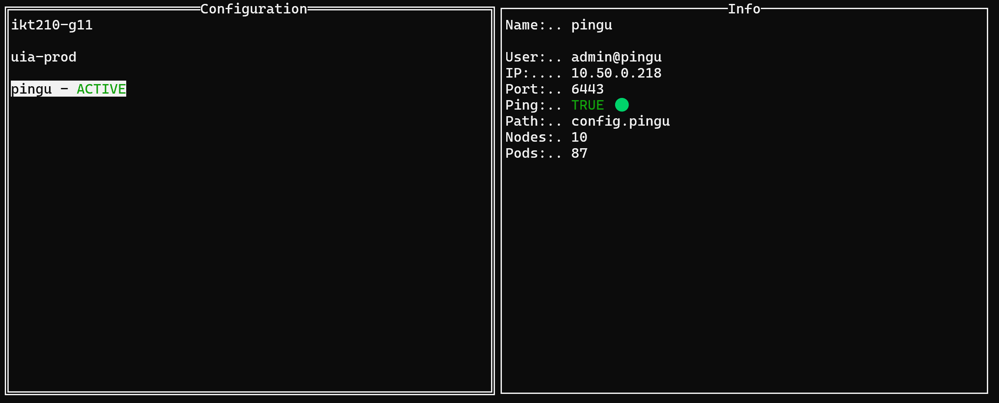

# k8s-Config-changer

**KKC – Kubernetes Config Changer**

A lightweight command-line tool for quickly switching between multiple Kubernetes `kubeconfig` files.

This tool is designed for developers, operators, and homelab users who work with multiple Kubernetes clusters and want a fast, simple, and reliable way to switch the active configuration without manually editing `$KUBECONFIG` or copying files by hand.

---

## 🚀 Features

- 🔁 Quickly switch between multiple kubeconfig files
- 📁 Centralized storage of kubeconfigs in a single directory
- ⚡ Simple and fast CLI with no external dependencies
- 🧩 Works seamlessly with `kubectl`
- 🖥️ Ideal for dev / staging / prod and multi-cluster environments

---

## 📦 Requirements

- Go (only required if building from source), **or**
- A pre-built binary

The tool itself has no runtime dependencies.

---

## 🛠 Installation

### Build from source

```bash
git clone https://github.com/ChrissFurenes/k8s-Config-changer.git
cd k8s-Config-changer
go build -o kkc main.go
```
Move the binary to a directory in your ```$PATH```:
```bash
sudo mv kkc /usr/local/bin/
```
Verify installation:
```bash
kkc
```



## 📂 Directory Structure
Your Kubernetes configuration directory should be structured as follows:
````
~/.kube/
├── config           # Active kubeconfig (used by kubectl)
└── configs/         # Stored kubeconfig files
    ├── config.dev
    ├── config.prod
    ├── config.test
    └── config.cluster-x

````

- ~/.kube/config is the file used by kubectl
- All files inside configs/ must be valid Kubernetes kubeconfig files